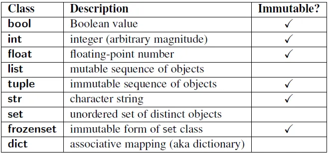

# Python3: Mutable, Immutable... everything is object!
---
# Introduction
What is an object? This is a question I've asked myself many times while learning Python, why and how different pieces of 
data are saved, or why it doesn't always work as I'm expecting it to? 


This is the "fun" part of Python, everything in Python is an object. It's stored somewhere in memory, has a type and a value.
Some are mutable, and some are immutable, but what's the difference, you may ask. Mutable objects are ones that you can change after
you create and initialize them, while immutable objects you can't change them once initialized. Though I will go more in-depth on each of these later, with learning and knowing the differences between ```is``` and ```==```.


```==```, checks if the objects have the same data/contents.

```is```, checks if the objects have the same ID (Same place in memory).

```
>>> list1 = [1, 2, 3]
>>> list2 = [1, 2, 3]
>>> print(list1 == list2)
True
>>> print(list1 is list2)
False
```

list1 and list2 both have the same data/contents, but have a different location in memory, I will go more into this later.

# Type and ID
Every object has a Type and an ID, you can test this simply like so:
```
>>> x = 123
>>> print(type(x))
<class 'int'>
>>> print(id(x))
140711789515704
```
Type: it's your data type or class of the object; these can range from int, str, list, bool, etc. In Python, you don't have to declare the type like other languages,
It self-assigns the data type of the object when created or updated.



Id: it's a unique ID that represents the memory address of the object. This will be evident later, you can have 2 different objects have the same value, 
but its Id will be different, as they're independent of that object but have the same value. BUT two different variables can also use the same ID, even though they are assigned
a different variable name.


# Mutable Objects
Whats mutable mean? Simply put, it means it's an object's value that can be modified and changed after being created, keeping the same ID.

A good example of this would be the following:
```
>>> list1
[1, 2, 3]
>>> id(list1)
2810460909504
>>> type(list1)
<class 'list'>
>>> list1.append(4)
>>> list1
[1, 2, 3, 4]
>>> type(list1)
<class 'list'>
>>> id(list1)
2810460909504
```
This shows how mutable objects work, the id of both the list NEVER changed. I edited and made the list longer, but the list's location
in the memory never changed. 


# Immutable Objects
Whats immutable mean? It means the object can never be changed once created. It may seem it's being changed, but its location in memory
is actually different, meaning that it's actually a new object, its not the one you originally had.

A good example of this would be the following:

```
>>> a = 92
>>> id(a)
140711789514712
>>> type(a)
<class 'int'>
>>> a += 7
>>> a
99
>>> type(a)
<class 'int'>
>>> id(a)
140711789514936
```
As you can see, the id of a changed, this is because when we changed the value of a, it remade the variable at a different memory address.

# Why does it matter?

Because knowing what you can see within your code and how it interacts with another!

Knowing what kind of object you're dealing with is important because of how different interactions work. As you have different functions and definitions, certain 
objects won't keep their "original value", so knowing when a value changes and how is important. When you pass an argument into a function using an object, a new reference to the same object is actually being pass through. If the object is mutable the function will change it and keep the Id. If immutable, any change inside actually creates a new object with a new memory using the variable passed through's values.

It can be seen in the following:
```
def add(b):
  b += 1
  print(b)

a = 6
add(a)
print(a)
```
You are using the variable a = 6 the whole time, so SURELY when you run this, it will print 7 both times?

Well, you would be wrong; it would print 6, 7.

This is because it's immutable, your creating a new object with ``` b += 1```. If we were to check the ID, it would produce two different memory locations.


# So what now?

You know the basics of immutable and mutable objects, you know that, depending on mutability, how you can interact with it. An important thing to know using this newfound understanding is aliasing. Aliasing is when two or more variables refer to the same object in memory.

An example of aliasing is:

```
>>> lista = [1 ,2, 3]
>>> listb = lista
>>> lista.append(5)
>>> lista
[1, 2, 3, 5]
>>> listb
[1, 2, 3, 5]
>>> id(lista)
2810461840704
>>> id(listb)
2810461840704
```
You may be thinking, "You only appended to lista though? Why do they have the same address?" This is because we referenced listb to lista, we didn't create a new list. This is why both id's are the same. This is the "dangers" of not knowing how mutability works, you may think you're creating a new list, while in practice you're just referencing. So any change you do to one of the lists affects the other, they both reference the same object. This is why it's important to understand what mutability is and how it works, so you avoid issues as such. 

If you ever want to copy a list and not just reference it like above, use ``` listb = lista.copy() ```. This creates a shallow copy; this creates a new object, thus a new memory location.
